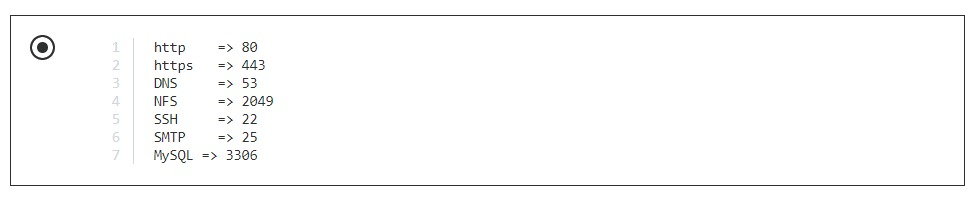

# Networking

|Contenu|
|-------|
|ISO|
|Comprendre les réseaux et l'IP|
|Protocoles, ports, etc.|
|Commandes réseau|

# **Quizz: Réseautage**

### **Question 1 :**
+ **Les couches OSI sont les suivantes**

### **Question 2 :**
+ **Le navigateur(Browser), le routeur(Router) et le commutateur(Switch) se trouvent à quelle couche du modèle OSI ?**

### **Question 3 :**
+ **Choisissez la bonne option.**

### **Question 4 :**
+ **`54.23.45.76` est une adresse `IP publique`**
  + **`VRAI`**

### **Question 5 :**
+ **`172.20.32.120` est une adresse `IP privée de classe B`**
  + `VRAI`

### **Question 6 :**
+ **`9.23.45.65` est une adresse `IP privée de classe A`**
  + **`FAUX`**

### **Question 7 :**
+ **Veuillez choisir la bonne option**

